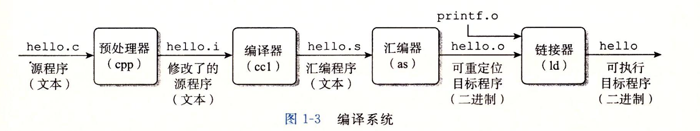

### ch1

    1.８个位等于一个字节
    2.一个hello 程序运行的过程(1.4.2)
    3.进程是操作系统对一个正在运行的程序的一种抽象，
    ４.进程，并发运行，并错执行，进程间切换(上下文切换)
    ５.上下文：操作系统保持跟踪进程运行所需的所有状态信息
    6.文件就是字节序列，每个I/O设备都可以看成文件
    ７.并发：一个同时具有多个活动的系统;并行：可以在计算机系统的多个抽象层次上运用

>编译系统



>存储器层次图


>操作系统提供的抽象表示


>位模式与十门进制


### 操作系统有两个基本的功能：
```
(1)防止硬件被失控的应用程序滥用
(2)向应用程序提供简单一致的机制来控制复杂而又通常大不相同的低级硬件硬件设备。
```