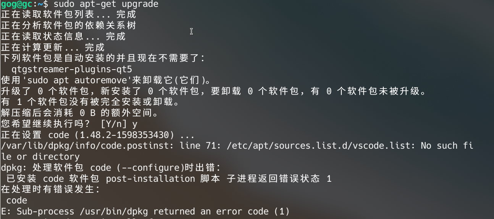

# dpkg:处理 xxx (--configure)时出错解决办法
当你执行 `sudo apt update`, 出现了下面类似问题 `dpkg:处理 xxx --configure`：



解决办法：
```
$ sudo mv /var/lib/dpkg/info /var/lib/dpkg/info_old 
$ sudo mkdir /var/lib/dpkg/info 
$ sudo apt-get update 
$ sudo apt-get -f install 
$ sudo mv /var/lib/dpkg/info/* /var/lib/dpkg/info_old 
$ sudo rm -rf /var/lib/dpkg/info 
$ sudo mv /var/lib/dpkg/info_old /var/lib/dpkg/info 
```
